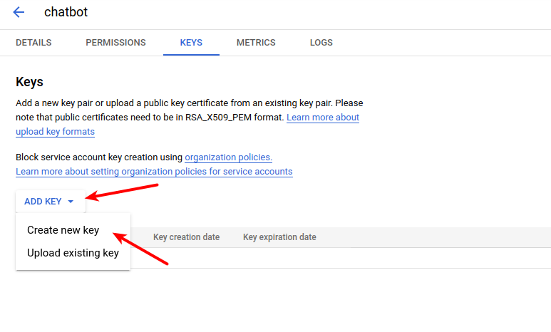

# BotMan DialogFlow Middleware

BotMan Middleware to connect DialogFlow with [BotMan](https://github.com/botman/botman)

[](https://packagist.org/packages/botman/driver-facebook)
[]()


Thank's to [@eclips16](https://github.com/eclips16). The code source was taken from [pull request](https://github.com/botman/botman/pull/1010).

## Installation

#### Composer

```
composer require genkovich/dialog-flow-bot-man-middleware
```

## Usage


### .env
``` dotenv
GOOGLE_CLOUD_PROJECT=project-id
GOOGLE_APPLICATION_CREDENTIALS=/path/to/security-file.json
```

### Where can I get this variables?

- Login at https://dialogflow.cloud.google.com/
- Create NewAgent (or use an existing one)
- Click on "Settings" icon (1)
- Copy your project id (2) into .env file
- Click on project id (2)

[](docs/img/first-step.png)
 - After that you will find "Service accounts" section (click (1) or (2))

[](docs/img/step-2.png)
- Click on "Create service account", fill "name" field and click "Create"

[](docs/img/step-3.png)
- On the next step you have to add two roles, "DialogFlow API Admin" and "DialogFlow API Client" and click "Done"

[](docs/img/step-4.png)
- Now, go to the page "Manage keys"

[](docs/img/step-5.png)
- Create new key in .json format

[](docs/img/step-6.png)

- Move downloaded file into project root directory
- Add path to file in .env

### Code example

``` php
$dialogflow = \BotMan\Middleware\DialogFlow\V2\DialogFlow::create('en');
$botman->middleware->received($dialogflow);
$botman->hears('smalltalk.(.*)', function ($bot) {
    $extras = $bot->getMessage()->getExtras();
    $bot->reply($extras['apiReply']);
})->middleware($dialogflow);
```

smalltalk.(.*) - there is action name pattern
[](docs/img/step-7.png)

If you create actions with different prefixes, you can use `->ignoreIntentPattern()`

``` php
$dialogflow = DialogFlow::create('en')->ignoreIntentPattern();
```

## Security Vulnerabilities

If you discover a security vulnerability within BotMan, please send an e-mail to Marcel Pociot at m.pociot@gmail.com. All security vulnerabilities will be promptly addressed.

## License

BotMan is free software distributed under the terms of the MIT license.